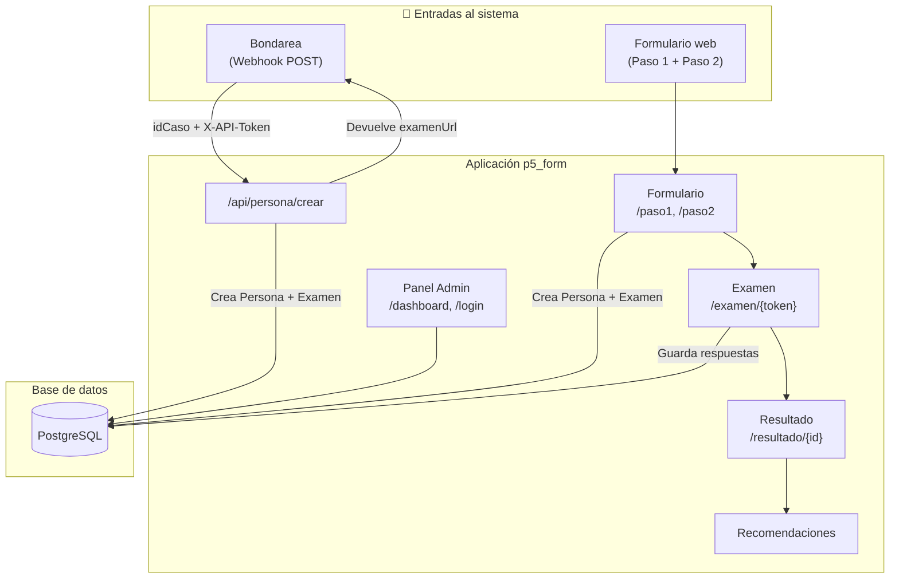
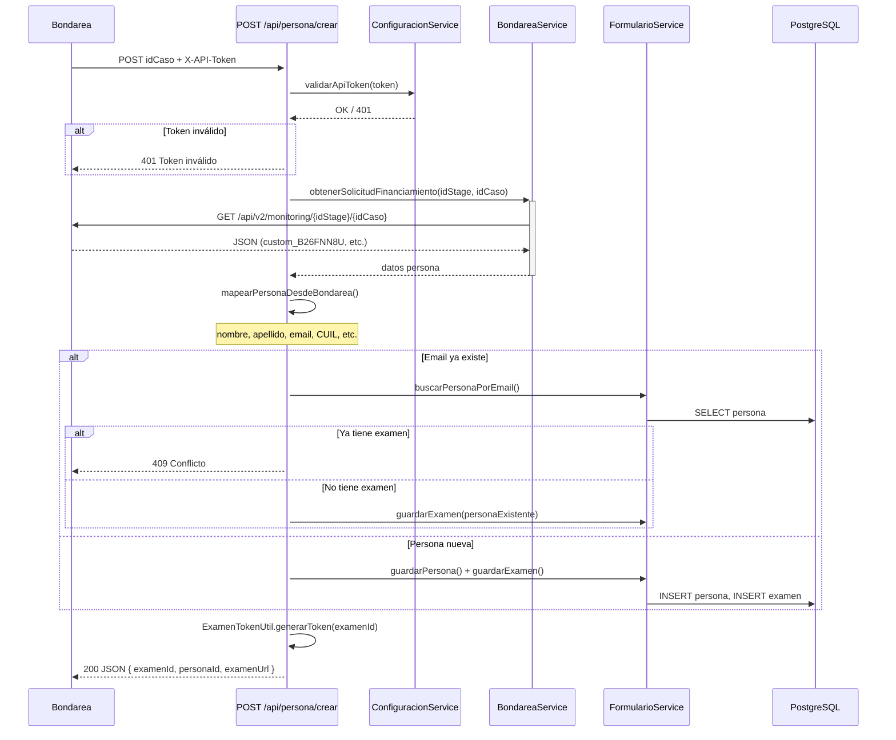
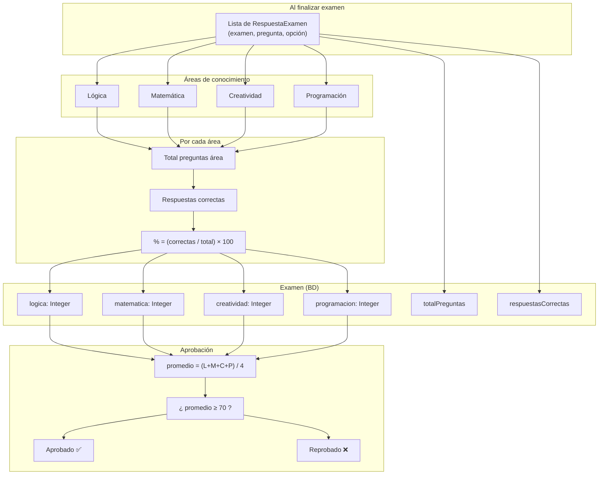
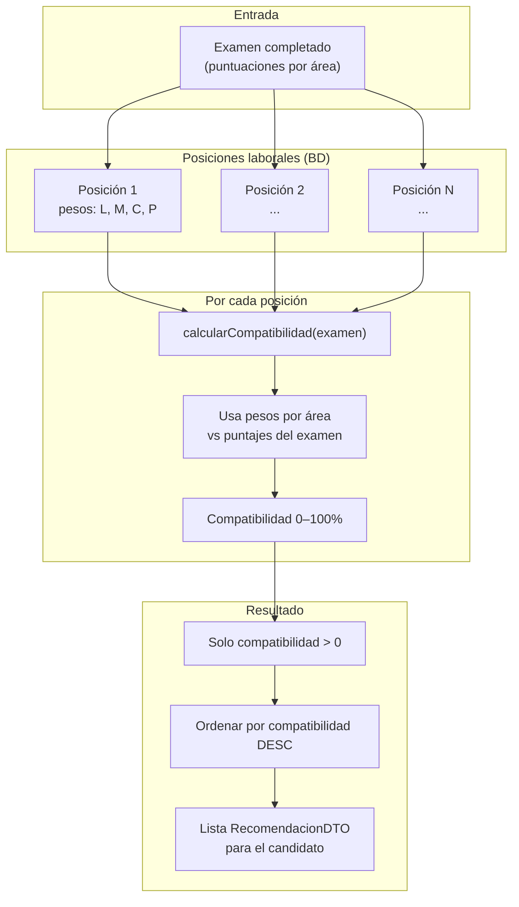
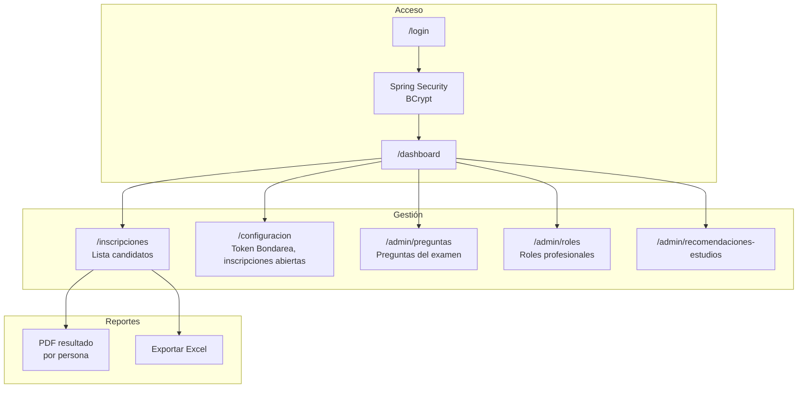
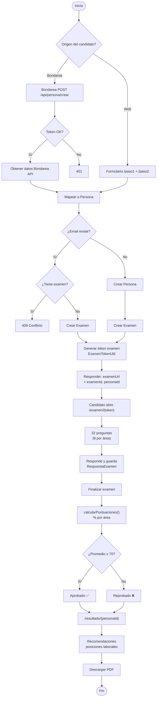

# 📊 Flujos del Sistema - Evaluación de Candidatos

Diagramas para entender el proceso completo. Compatible con **Mermaid** (GitHub, VS Code, Cursor).

---

## 1. Vista general: entradas y módulos



---

## 2. Flujo Bondarea → Examen (integración externa)



---

## 3. Flujo del candidato: hacer el examen

```mermaid
flowchart LR
    subgraph ACCESO["Acceso al examen"]
        A1["Recibe link\n/examen/{token}"]
        A2["Valida token\nExamenTokenUtil"]
        A3["Carga examen\n+ persona"]
    end

    subgraph EXAMEN["Realización"]
        B1["Genera 32 preguntas\n8 por área"]
        B2["Lógica · Matemática\nCreatividad · Programación"]
        B3["Candidato responde\ncada pregunta"]
        B4["Guarda RespuestaExamen\npor cada una"]
    end

    subgraph FIN["Finalización"]
        C1["finalizarExamen()"]
        C2["calcularPuntuaciones()\n% por área"]
        C3["fechaFin, totalPreguntas\nrespuestasCorrectas"]
        C4["Aprobado si\npromedio ≥ 70"]
    end

    subgraph RESULTADO["Resultado"]
        D1["/resultado/{personaId}"]
        D2["Ver puntajes\n+ PDF"]
        D3["Recomendaciones\nposiciones laborales"]
    end

    A1 --> A2 --> A3 --> B1 --> B2 --> B3 --> B4 --> C1 --> C2 --> C3 --> C4 --> D1 --> D2 --> D3
```



---

## 4. Cálculo de puntuaciones y aprobación



---

## 5. Recomendaciones de posiciones laborales



---

## 6. Panel administrativo (resumen)



---

## 7. Flujo completo en una página (simplificado)



---

## Cómo ver los diagramas

- **GitHub:** al subir este `.md`, los bloques ```mermaid se renderizan automáticamente.
- **VS Code / Cursor:** instalar extensión "Mermaid" o "Markdown Preview Mermaid Support" y abrir la vista previa del Markdown.
- **Online:** copiar el contenido de un bloque `mermaid` en [mermaid.live](https://mermaid.live) para editar y exportar a PNG/SVG.

---

**Versión:** 1.0 · **Proyecto:** p5_form
